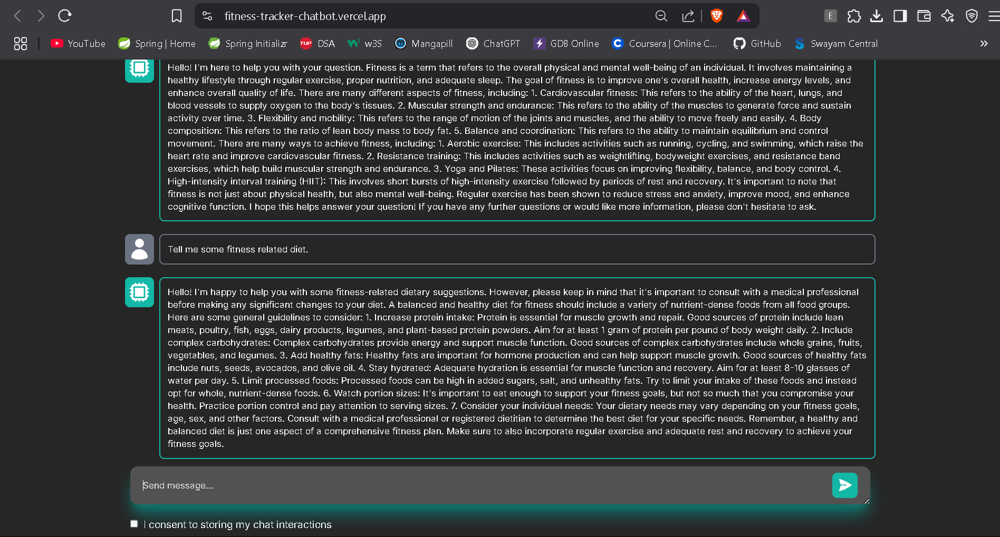

# 🏃‍♀️ Fitness Tracker Chatbot

## 📖 Overview

A **Next.js-based fitness tracking chatbot** that helps users log workouts, track progress, and get fitness recommendations. The chatbot uses **Replicate's AI model** for natural language processing and **MongoDB** for data persistence.

## 🖼️ Fitness Chatbot Screenshot
  

## 🌐 Live Demo

Check out the live version here: [Fitness Chatbot on Vercel](https://fitness-tracker-chatbot.vercel.app/)

## ✨ Features

- 💬 Interactive chat interface for fitness tracking  
- 🏋️‍♂️ Log workouts and track fitness progress  
- 🍎 Nutrition tracking integration  
- 🔄 Persistent chat history with user consent  
- 🤖 AI-powered responses for fitness recommendations  

## 🛠️ Technologies Used

- **Frontend:** Next.js 14, React, Tailwind CSS  
- **Backend:** Next.js API Routes  
- **Database:** MongoDB  
- **AI:** Replicate's AI models  
- **Deployment:** Vercel  

## 🚀 Getting Started

### ⚙️ Prerequisites

- Node.js (v18 or later)  
- MongoDB Atlas account (for database)  
- Replicate API token (for AI functionality)  

### 🧩 Installation

1. **Clone the repository:**

   ```bash
   git clone https://github.com/snehabansal483/fitness-tracker-chatbot.git
   cd fitness-tracker-chatbot
   ```

2. **Install dependencies:**

   ```bash
   npm install
   ```

3. **Create a `.env.local` file** in the root directory with the following variables:

   ```env
   MONGODB_URI=your_mongodb_connection_string
   REPLICATE_API_TOKEN=your_replicate_api_token
   ```

4. **Run the development server:**

   ```bash
   npm run dev
   ```

5. **Open** `http://localhost:3000` in your browser.

## 🗂 Project Structure

```
fitness-tracker-chatbot/
├── README.md                       # Main project readme file
├── Screenshots/                    # Folder for storing images/screenshots
│   ├── main.png                    # Screenshot of the main chatbot interface
│   ├── response.jpg                # Screenshot of the chat interface with AI response       
└── fitness-bot/                    # Main app directory
    ├── README.md                   # Readme for the app folder (optional)
    ├── jsconfig.json               # JavaScript configuration for Next.js
    ├── next.config.mjs             # Configuration for Next.js
    ├── package-lock.json           # Package lock file
    ├── package.json                # Project dependencies
    ├── postcss.config.mjs          # PostCSS configuration for styling
    ├── tailwind.config.js          # Tailwind CSS configuration
    ├── .eslintrc.json              # ESLint configuration for code linting
    ├── .gitignore                  # Git ignore file
    ├── .env.local                  # Environment variables (not included in repo)
    ├── app/                        # Main Next.js app directory
    │   ├── globals.css             # Global CSS styles
    │   ├── layout.js               # Layout for the app
    │   ├── page.js                 # Main page component
    │   └── api/                    # API routes
    │       └── route.js            # API route handler
    └── public/                     # Static files (e.g., images, icons)
```

## ⚙️ Configuration

- **`next.config.mjs`** – CORS and API route configurations  
- **`tailwind.config.js`** – UI styling configuration  
- **`.env.local`** – Environment variables  

## 🧑‍💻 Usage

- Start a conversation by typing your fitness-related question or log entry.  
- Toggle the consent checkbox to allow chat history storage.  
- The chatbot will respond with fitness recommendations or log your entries.

## 🖼️ Chat Interface Screenshot

  

## 📡 API Endpoints

- `GET /api` – Fetches previous chat history  
- `POST /api` – Processes new chat messages and returns AI responses  

## 🚀 Deployment

The easiest way to deploy this Next.js application is to use **Vercel**:

[](https://vercel.com)

### 🌐 Live Demo

Check out the live version here: [Fitness Chatbot on Vercel](https://fitness-tracker-chatbot.vercel.app/)

## 🤝 Contributing

Contributions are welcome!  
Please open a [new issue](https://github.com/snehabansal483/fitness-tracker-chatbot/issues/new) or submit a pull request.

## 📄 License

This project is licensed under the MIT License.
